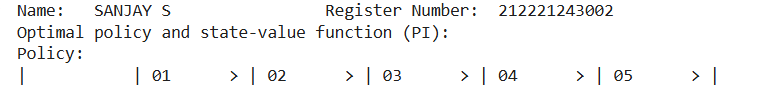
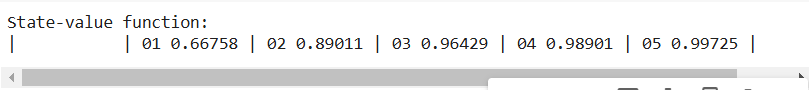
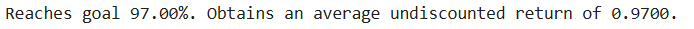

# POLICY ITERATION ALGORITHM

## AIM
To develop a Python program to find the optimal policy for the given MDP using the policy iteration algorithm.

## PROBLEM STATEMENT
The bandit slippery walk problem is a reinforcement learning problem in which an agent must learn to navigate a 7-state environment in order to reach a goal state. The environment is slippery, so the agent has a chance of moving in the opposite direction of the action it takes.

## POLICY ITERATION ALGORITHM
### Initialization:
We begin by initializing the policy, denoted as π. Initially, random actions are assigned to each state in the MDP, forming an initial policy.

### Iterative Loop:
The heart of policy iteration lies in an iterative loop, which continues until the policy no longer changes significantly. This termination condition is achieved by comparing the current policy with the previous one.

### Policy Evaluation:
Within each iteration, we perform policy evaluation using the function policy_evaluation. This step calculates the state-values (V) for each state under the current policy. These values represent the expected cumulative rewards, accounting for discounting future rewards by a factor of γ.

### Policy Improvement:
Following policy evaluation, we update the policy using policy_improvement. This step leverages the computed state-values to enhance the policy, aiming to make better decisions.

### Convergence Check:
After each policy improvement step, we check for convergence by comparing the current policy with the previous one. If there is no significant change across all states, the loop terminates, signifying that the optimal policy has been found.

## POLICY IMPROVEMENT FUNCTION
### Name : SANJAY S
### Register Number: 212221243002

```
def policy_improvement(V,P, gamma = 1.0):
  Q = np.zeros((len(P),len(P[0])),dtype = np.float64)
  for s in range(len(P)):
    for a in range(len(P[s])):
      for prob,next_state,reward,done in P[s][a]:
         Q[s][a]+=prob*(reward+gamma*V[next_state]*(not done))

  new_pi = lambda s: {s:a for s,a in enumerate(np.argmax(Q,axis=1))}[s]

  return new_pi
```

## POLICY ITERATION FUNCTION


```
def policy_iteration(P,gamma=1.0,theta=1e-10):
  random_actions = np.random.choice(tuple(P[0].keys()),len(P))
  pi = lambda s: {s:a for s,a in enumerate(random_actions)}[s]

  while True:
    old_pi = {s:pi(s) for s in range(len(P))}
    V = policy_evaluation(pi,P,gamma,theta)
    pi = policy_improvement(V,P,gamma)

    if old_pi == {s:pi(s) for s in range(len(P))}:
      break
  return V,pi
```

## OUTPUT:

### optimal policy:

### optimal value function:

### success rate for the optimal policy:



## RESULT:

Thus, a Python program is developed to find the optimal policy for the given MDP using the policy iteration algorithm.


